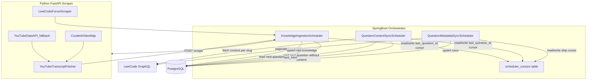
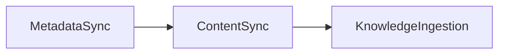
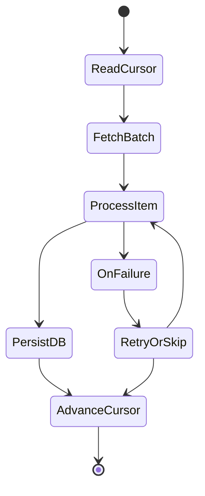

# CheetCode MVP Plan — Phase 1: Cursor-Based Schedulers

## Goal

**Phase 1** builds **three independent schedulers**, each with **one cursor** — no sub-cursors:

1. **QuestionMetadataSyncScheduler** — Fetch LeetCode question list (ID, slug, title, difficulty) → upsert into `questions`.
2. **QuestionContentSyncScheduler** — Fetch full problem description per question → update `questions.content_html`.
3. **KnowledgeIngestionScheduler** — Scrape YouTube transcripts + LeetCode forum posts per question → save into `knowledge_sources`.

Schedulers 1 and 2 run in **Spring Boot** (LeetCode GraphQL via WebClient). Scheduler 3 orchestrates in Spring but delegates scraping to a **Python FastAPI service**.

LLM solution generation, validation, auth, frontend, and embedding/RAG retrieval are **deferred to Phase 2+**.

---

## Current repo state

[`c:\Users\Shrey\Downloads\cheetcode\cheetcode`](c:\Users\Shrey\Downloads\cheetcode\cheetcode) is a Spring Boot 4.1 / Java 21 scaffold with JPA, PostgreSQL driver, and WebClient in [`pom.xml`](pom.xml). No schema, schedulers, or Python service exist yet.

---

## Architecture (Phase 1)



### Scheduler dependency chain



- **S2** only processes questions that exist in DB but have `content_html IS NULL` and `is_premium = false`.
- **S3** only processes questions where `content_html IS NOT NULL`.
- Schedulers are independent jobs with separate crons — S2/S3 simply no-op when nothing matches their query.

---

## Cursor-based fail-safe design

Each scheduler owns **exactly one row** in `scheduler_cursors`. Simple, no nested keys.

### `scheduler_cursors` table

| Column | Purpose |
|--------|---------|
| `scheduler_name` | PK — `QUESTION_METADATA_SYNC`, `QUESTION_CONTENT_SYNC`, `KNOWLEDGE_INGESTION` |
| `cursor_value` | Single checkpoint value (stored as string, parsed by scheduler) |
| `updated_at` | Last successful advance |

### One cursor per scheduler

| Scheduler | Cursor meaning | Advance rule |
|-----------|---------------|--------------|
| **QuestionMetadataSyncScheduler** | `skip` offset into LeetCode catalog | +100 after each successful GraphQL page upsert; reset to 0 when `skip >= total` |
| **QuestionContentSyncScheduler** | `last_question_id` processed | Set to current question's `id` after `content_html` fetch + DB update |
| **KnowledgeIngestionScheduler** | `last_question_id` processed | Set to current question's `id` after YT + forum scrape attempts complete |

### Shared rules (all schedulers)

- Advance cursor **only after** the DB transaction commits.
- On transient HTTP failure: retry with backoff; **do not** advance.
- On permanent failure (premium question, no captions): log, record status, advance cursor.
- Each cron tick processes **one batch** then exits — no long in-memory loops.
- Optional: ShedLock to prevent overlapping runs of the same scheduler across instances.

### Scheduler execution model



---

## Database schema (Phase 1)

### `questions`

| Column | Notes |
|--------|-------|
| `id` | PK |
| `leetcode_question_id` | Unique |
| `title_slug` | Unique |
| `title`, `difficulty` | From metadata scheduler |
| `content_html` | From content scheduler; nullable until synced |
| `is_premium` | Content scheduler skips if true |
| `metadata_synced_at`, `content_synced_at` | Timestamps |

### `knowledge_sources`

| Column | Notes |
|--------|-------|
| `id` | PK |
| `question_id` | FK → `questions.id` |
| `source_type` | `YOUTUBE_TRANSCRIPT` \| `LEETCODE_FORUM` |
| `source_url` | Video URL or forum post URL |
| `source_title` | Video/post title |
| `author` | Channel name or forum username |
| `raw_content` | Transcript or forum body (raw, uncleaned) |
| `metadata` | JSONB — `{video_id, post_id, upvotes, ...}` |
| `status` | `SUCCESS` \| `FAILED` \| `NOT_FOUND` |
| `error_message` | Nullable |
| `scraped_at` | Timestamp |

Unique constraint: `(question_id, source_type, source_url)`.

---

## Scheduler 1 — QuestionMetadataSyncScheduler (Spring)

Paginates LeetCode `problemsetQuestionList` via WebClient.

```graphql
query problemsetQuestionList($categorySlug: String, $limit: Int, $skip: Int, $filters: QuestionListFilterInput) {
  problemsetQuestionList(categorySlug: $categorySlug, limit: $limit, skip: $skip, filters: $filters) {
    total
    questions { questionId title titleSlug difficulty isPaidOnly }
  }
}
```

**Per tick:** read `skip` cursor → fetch one page (limit 100) → upsert all rows → advance cursor by 100.

Runs daily or on-demand. No rate limit needed (one request per tick).

---

## Scheduler 2 — QuestionContentSyncScheduler (Spring)

Fetches full problem HTML for questions missing content.

```graphql
query questionContent($titleSlug: String!) {
  question(titleSlug: $titleSlug) { content }
}
```

**Per tick:**
1. Read `last_question_id` cursor.
2. Select: `WHERE id > cursor AND content_html IS NULL AND is_premium = false ORDER BY id LIMIT 1`.
3. Fetch content via GraphQL for that slug.
4. Update `questions.content_html`, set `content_synced_at`.
5. Advance cursor to this question's `id`.

Rate limiting: random sleep 1.5–4.0s before each LeetCode request.

---

## Scheduler 3 — KnowledgeIngestionScheduler (Spring orchestrates, Python scrapes)

### Python FastAPI endpoints

**`POST /scrape/youtube`**
```json
{ "question_slug": "two-sum", "question_title": "Two Sum", "max_videos": 3 }
```
Discovery: curated video map first → YouTube Data API search fallback → `youtube-transcript-api`.

**`POST /scrape/forum`**
```json
{ "question_slug": "two-sum", "max_posts": 5 }
```

### Per tick (Spring)

1. Read `last_question_id` cursor.
2. Select: `WHERE id > cursor AND content_html IS NOT NULL ORDER BY id LIMIT 1`.
3. Call Python `/scrape/youtube` and `/scrape/forum`.
4. Upsert results into `knowledge_sources`.
5. Advance cursor to this question's `id`.

Partial success (YT ok, forum failed): save what succeeded, still advance cursor.

---

## Python service layout

```
cheetcode/
├── src/                          # Spring Boot
├── python-service/
│   ├── pyproject.toml
│   ├── app/
│   │   ├── main.py
│   │   ├── routers/youtube.py, forum.py
│   │   ├── services/transcript_fetcher.py, youtube_search.py, forum_scraper.py
│   │   └── data/curated_videos.json
│   └── Dockerfile
└── docker-compose.yml
```

---

## Spring Boot additions

| Addition | Why |
|----------|-----|
| `spring-boot-starter-web` | Manual trigger endpoints + future API |
| Flyway | Migrations for `questions`, `knowledge_sources`, `scheduler_cursors` |
| `@EnableScheduling` | Three independent cron jobs |
| `PythonScraperClient` | WebClient calls to Python |
| `SchedulerCursorRepository` | One-row-per-scheduler checkpoint CRUD |

Config:
```properties
scheduler.metadata-sync.cron=0 0 2 * * *
scheduler.content-sync.cron=0 */10 * * * *
scheduler.knowledge-ingest.cron=0 */30 * * * *
python.scraper.base-url=http://localhost:8000
```

---

## Phase roadmap

### Phase 1 — Schedulers (current focus)
- Flyway + entities + cursor repository
- QuestionMetadataSyncScheduler
- QuestionContentSyncScheduler
- Python scraper service
- KnowledgeIngestionScheduler
- Docker Compose for local Postgres + Python

### Phase 2 — LLM + validation (deferred)
- Clean/chunk knowledge, RAG retrieval, solution generation, sandbox validation

### Phase 3 — Product (deferred)
- Auth, likes, points, semantic search, React frontend

---

## Bottom line

Three **simple, independent schedulers** — each with **one cursor, one job, one cron**:

| # | Scheduler | Cursor | Runs in |
|---|-----------|--------|---------|
| 1 | Metadata sync | `skip` | Spring |
| 2 | Content sync | `last_question_id` | Spring |
| 3 | Knowledge ingestion | `last_question_id` | Spring + Python |

When you approve, implementation starts with Flyway migrations + `scheduler_cursors` + QuestionMetadataSyncScheduler.
